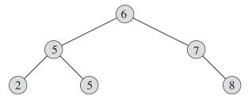
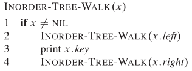

# Binary Search Tree
## 引子：Runway Reservation System
- Airpot with a single runway
-  Reserve req specify “requested landing time” t
-  Add t to the set if no other landings are scheduled within k minutes.
-  Remove t from set R after it lands
  
### Example

  

Request for time: 44 not allowed (46 ∈ R); 53 OK; 20 not allowed (already past)

##  Can we do better
- **Sorted array**: a k minute check can be done in O(1) but insertion(shifting) takes O(n).
- **Min heap**: insert in O(lgn) time but k minute check takes O(n) time
- **Sorted linked list**: cant do the binary search.

## BST 

  

**Binary-search-tree property:**Let x be a node in a binary search tree. 

If y is a node in the left subtree of x, then y.key <= x.key. 

If y is a node in the right subtree of x, then y.key >= x.key.

### Inorder tree walk
The binary-search-tree property allows us to print out all the keys in sorted order.
(Similarly, a **preorder tree walk** prints the root before the values in either subtree, and **a postorder tree walk** prints the root after the values in its subtrees.)

  
   
  <em> INORDER-TREE-WALK(T.root) </em> 

